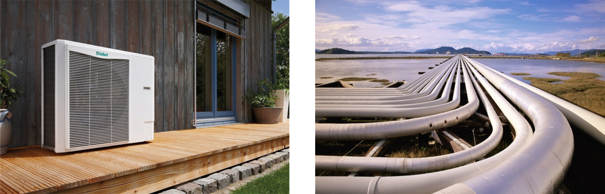
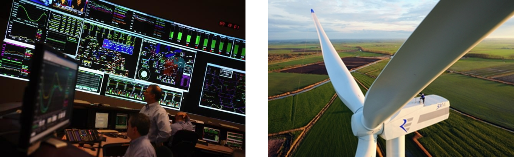
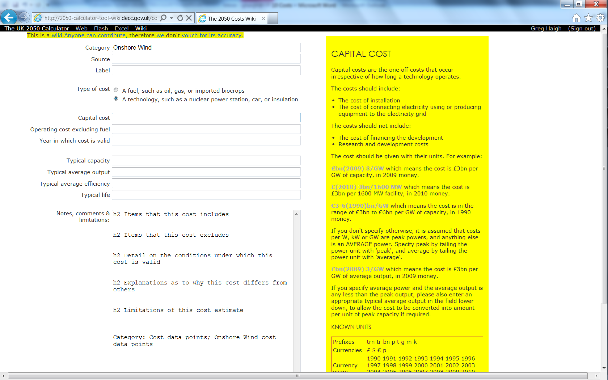
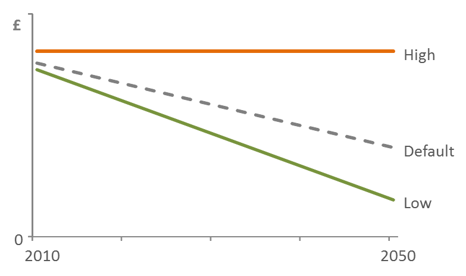

#Costs in the 2050 Calculator
##Objectives: why include costs
The first version of the UK 2050 didn’t include any cost information.  As a result, common reactions were ‘how much will tackling climate change cost?’ and ‘how much will my pathway cost?’
In response, an exercise was undertaken to add this capability to the tool.  The objective was to reflect all of the monetary impacts of the users choices, with the analysis covering all aspects of the energy system.
The four effort levels of choice that are available to the user are based on what is technically possible, without any consideration of the financial consequences.  Including the costs analysis extends the feasibility debate, allowing users to consider the economic implications of their choices.  
The costs analysis answers the questions raised above, telling the user how much their pathway costs compared to other mitigation pathways, and compared to not tackling climate change.
##Gathering costs data
The costs analysis is intended to encompass the entire energy system, so that all of the financial implications of the users choices are accounted for.  Costs are categorised into three types:
1. Capital expenditure: the full costs of all capital components, from the heat pumps installed in individual homes, through to large infrastructure projects.

2. Operating and maintenance costs: the full cost of running and maintaining all of the required 
technology and infrastructure, again from individual homes to the national level.
3. Fuel costs: the costs of all involved fuels, from municipal sewage to enriched uranium.

An open online wiki was used in the development of the UK Calculator costs analysis, allowing interested parties from industry, academia, NGOs and civil society to submit cost information.  The wiki provided entry field for all required supplementary information and contextual help to ensure that users submitted evidence consistently.  For example, when submitting data for the cost of an offshore wind turbine, it was necessary to specify a number of details:
1. the capacity of the turbine in question
2. whether the estimate was for the capital (i.e. the turbine itself) or for operation / maintenance
3. the year for which the estimate was being made (either 2010 or 2050)
4. the year in which the price was valid (e.g. 2010), to allow for inflation to be accounted for
This approach allowed the costs data to be efficiently gathered and organised in a standardised fashion.

Predictable, there is a high degree of uncertainty around many of the cost estimates required for the analysis, particularly in 2050.  In order to account for this, submitters were asked to enter their estimates as a range, by specifying both high and low estimates for each entry.
The cost ranges submitted were then combined to form an overall range for each technology and type (e.g. maintenance costs), with the bottom of the range being based on the lowest of all of the estimates submitted and the top of the range being based on the highest.  This was repeated for both 2010 and 2050.  A few refinements were then made to supplement this approach:
1. To fully account for any up-side risks related to the uncertainty of costs in 2050, it was assumed that there would be no decline in costs in the period to 2050 (i.e. the high estimate for 2050 was set equal to the high estimate for 2010).
2. In order aid comparability a ‘default’, or ‘point’ cost was estimate was constructed.  This was done by aligning the default with a comparable estimate the established MARKAL technology costs database.  Where no appropriate comparison was available from MARKAL, the default was set at the 35th percentile within the range (as where matches were found in the MARKAL database, they tended to be in this vicinity).
3. It was assumed that the costs follow a linear path between 2010 and 2050

##Technology example
To illustrate the approach above, the following steps outline the process used to construct the capital cost range estimates for a particular technology: Electric Vehicles

1. Estimates are gathered via the wiki
Participants enter their estimates using the form provided, including:
a. The source of their evidence
b. A label for the estimate
c. The capital cost in the format specified by the contextual help window, e.g. ‘£(2011) 30990/car’, which includes details of the currency (£), the year in which the nominal value is based (2011 money), the actual estimate (30990), and the unit for which the estimate is based (1 car).
d. The year in which the cost is valid, i.e. is this an estimate of the cost of an electric vehicle in 2010 or in 2050?
e. Some additional supplementary information, e.g. the typical life
2. Create ranges for the capital cost estimates for 2010 and 2050
a. To construct the range for 2010, gather all of the 2010 based estimates
b. Set the bottom of the range equal to the lowest estimate received (from wiki: £28,990).
c. Set the top of the range equal to the highest estimate received (from wiki: £ 59,440), to yield a range from £28,990 to £59,440.
d. The 2050 range is constructed in the same way, except as described above, the top of the range is set equal to the top of the 2010 range (to cautiously assume that the technology costs do not fall).   This yields a range of £14,125 to £59,440 for 2050.
3. Create a linear cost profile from 2010 to 2050
a. This done in the Excel workbook, using a ‘delta’, which represents the change in cost per period, i.e. the cost in 2050 minus the cost in 2010 divided by 40 (the number of years in the period).  For 2020, the estimate is equal to the 2010 estimate plus ten (the number of years from 2010 to 2020) times the delta.  This is only done for the low estimate cost profile, as the high estimate remains constant from 2010 to 2050.
4. Create a default cost curve
a. The default may be set at the 35th percentile between the high and low cost curves.  If there is particularly strong evidence to suggest what the default cost will be, this can used instead.
##Presenting costs
The cost estimates in the UK Calculator are summarised in different ways in order to more easily make comparisons between pathways.
In the ‘CostAbsolute’ worksheet all of the costs from the individual sectors are drawn together.  (This is done using index match formula similar to those used in the year sheets; see the ‘Complex Excel Formulae’ section of Annex 1 for more details.)   Further calculations are performed to reveal:
* Cashflow implications
* NPV (net present value)
* Financing costs
* Amortised cashflow
* Amortised NPV
The amortised costs show the total costs over the entire modelled period to 2050 prorated to give an annual average.
In the ‘CostPerCapita’ worksheet, the above cost summaries are divided by the population projections shown in the ‘Global assumptions’ worksheet, to give per person estimates.  Among these results is the amortised per capital cashflow summed over all of the sectors, which serves a convenient single figure with which to represent an entire pathways costs.
[!](./figures/cost-range-chart.png)
On the webtool, there are three main graphical representations of the costs:
1. Costs in context
This shows the single amortised cost per capita figure for all of the example pathways, with estimates of today’s energy costs and GDP in 2050 for context
2. Costs compared
Amortised cost per capita is split by broad category, revealing the main drivers of cost
3. Costs Sensitivities
This allows users to flex the assumptions behind the cost analysis by allowing them to choose high, medium or default estimates for each sector.  The impact this has on the cost calculation is highlighted.

