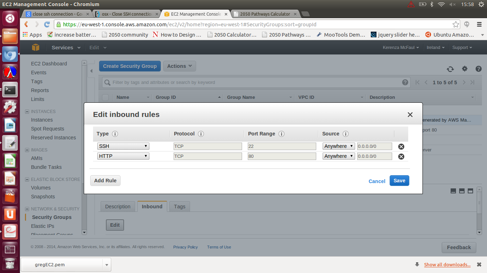

#How to deploy the webtool on the AWS EC2 - a guide to getting your Calculator online for public use

##Introduction
In order for the public to access your Calculator, it needs to be installed on a public webserver, where the public can access it via their browsers using a URL.

Amazon Web Services (AWS) provides a cost effective solution which is reletively easy to set up.  The AWS EC2 (Elastic Cloud Computing) gives you access to a virtual computing environments, known as instances, on which you can install your calculator.  You are able to specify the operating system you would like the instance to use (i.e. Ubuntu 12.04) and once connected it behaves and can be controlled just like any computer running Ubuntu.  You can open a terminal of the instance on your local computer, and control it in the same way.  At this point you will be able to set-up your Calculator on the instance by using the existing 'setup-ubuntu-12.04.sh' script.  Full, beginning to end, step-by-step, instructions are given below.

##Step-by-step instructions

1.  Setup an AWS account

Go to aws.amazon.com and select 'Create an account'

2. Login and select EC2.  This opens the EC2 dashboard

2. Chnage your region from the drop-down in the top right and menu

3. From the menu select 'Key Pairs' (A Key Pair is a bit like passwords for accessing your account/server, but it is  stored in a file on your computer so you don't have to rememeber it).
click - 'Create Key Pair'
You will be prompted to choose a name for your new Key Pair.  Enter a name of your choice the name of your Key Pair, e.g. 'myAWSEC2'.  This name will be used to generate a file with a '.pem' extension, e.g. 'myAWSEC2.pem, that will automatically be downloaded to your computer.

4. The following line of code will change the permissions of your Key Pair file so that only you can read it ()

    $ chmod 400 myASWEC2.pem
    

3. On the dashboard, click Launch Instance.

Seach for Ubuntu 12.04 in the AWS Marketplace tab, and select an instance of the following type: 'Ubuntu Server 12.04 LTS'
Select launch
Prompted to select a Key Pair.  Choose the one you just created (myAWSEC2)

You will be prompted to choose an instance type, allowing you to pick the specificatons you would like for the instance.  The UK Calculator uses a c1.medium instance (this costs $0.13 per hour).

4. Connect to your instance using SSH

Once the instance has initiated, it should be showing as 'running' in the instances view.

Your Mac or Linux computer most likely includes an SSH client by default. You can check for an SSH
client by typing ssh at the command line. If your computer doesn't recognize the command, the OpenSSH
project provides a free implementation of the full suite of SSH tools. For more information, see ht-
tp://www.openssh.org.

Open a terminal and enter the following command:

    ssh -i /path/key_pair.pem ubuntu@public_dns_name

edit the path/file name to the Key Pair that you created above, and the public_dns_name to that displayed in the 'Instances' section of the AWS Console.  The actual command should end up looking something like this:

ssh -i /etc/ssl/certs/myAWSEC2.pem ubuntu@ec2-54-74-14-220.eu-west-1.compute.amazonaws.com

If successful the terminal prompt should change to something like ubuntu@ip-10-32-37-22:~

From this terminal it is now possible download and run the Ubuntu set-up script to set up your Calculator, using the commands below:

    wget https://raw.githubusercontent.com/decc/twenty-fifty/master/util/setup-ubuntu-12.04.sh 
    sh setup-ubuntu-12.04.sh

During the set-up you will be prompted to enter the URL of your Calculators Git repository.  This is available from your GitHub reposity page, labelled 'HTTPS clone URL'.

The script will also ask 'Would you like to set up the nginx web server to run this? Not needed for development, just when you want to run a live version for the world (Y/N)'

As we are setting up the public version, enter 'Y'.

If the message "The code should now be available on this computer" appears, the script has worked successfully.

7. Editing Security Groups

It may be necessary to edit the 'security groups' of your instance
 - Click on the security groups item in the EC2 Console left-hand menu.
 - Select your instance
 - click on the edit button
 - alter the settings to match the image below

8.  Open your Calculator (for a snappier URL, you will have to purchase a domain and map the IP to your new URL)

Trouble shooting:

vim /etc/nginx/sites-enabled/2050.conf - this file shows the location of the enabled site (line 4: root /home/ubuntu/twenty-fifty/public;).  This needs to be reflected in the 2050.conf file:

Edited /etc/nginx/sites-enabled/2050.conf 
root /home/ubuntu/twenty-fifty/public;  (added 'twenty-fifty')

c1.medium ($0.13 per hour) ($1138.8 per year)
Amazon Machine Images (AMIs)
/etc/ssl/certs/gregEC2.pem 
Ubuntu Server 12.04 LTS 
2050-1 is the UK calculator

ssh -i /etc/ssl/certs/gregEC2.pem ubuntu@ec2-54-74-14-220.eu-west-1.compute.amazonaws.com
