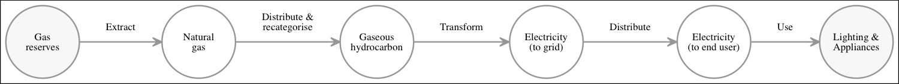
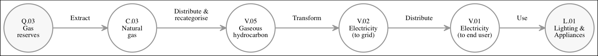
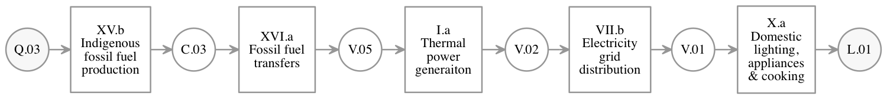
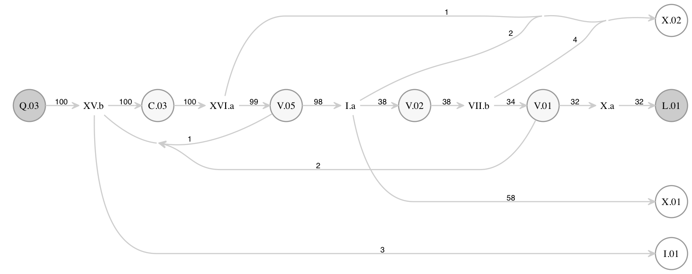

Appendix 10: Going further: energy, vectors, and models 
=======================================================

Overview
--------

### Energy

Energy is the capacity to do work. We make our lives easier by using energy to
do work for us. In so doing, the energy is transformed: from natural gas to
heat, from coal to electricity, from electricity to light. Any model of the
energy system is therefore necessarily a model of the transformation of energy
from one form to another.

The 2050 Calculator is such a model. It tracks the energy used by a country from
its original sources to its final uses. This note explains how the Calculator
keeps track of energy, what the different kinds of energies mean, and the
physical principles the Calculator models.

### How to read this Appendix

You can read this note either before you have opened the Calculator or after you
have looked at it for a bit. If you have never opened the Calculator then you
should read the first few sections, at least until you have an idea what a "fuel
type" is. Then look at one of the annual summary worksheets in the Calculator
(the tabs labelled by years) so that you can make these ideas concrete.

If you have already opened the Calculator then you will likely have a number of
questions---among them, I suspect, "why is there a 'gaseous hydrocarbons' fuel
type?", and "what's up with bioenergy?" Those questions are answered below but
it is nonetheless worth reading the first few sections. Knowing the precise
meaning of "fuel type" is helpful to understanding the answers to those two
questions.

The rest of this note is structured as follows. First, I describe a simplistic
energy system, used in the subsequent sections as an example. The main section
explains the entities found in the Calculator. Then there is a short comparison
to the usual way of presenting national energy accounts. Finally, there is an
explanation of some of the design principles which motivated the workings of the
Calculator, and a discussion of the ways in which original Calculator falls
short of those design desiderata.

### An example energy system

In order to get a feel for the sort of system the Calculator models, it's
instructive to consider a very simplistic energy system and to follow one
particular flow of energy all the way through that system. The diagram below
shows a simplified version of that part of the energy system which involves gas
as a fuel for power generation. I shall describe the steps in this system one by
one.

Buried under the North Sea are reserves of methane, a source of chemical
energy. For this gas to be of any use it first has to be got out from under the
North Sea. In the Calculator, extracting gas from under the North Sea is
modelled as a transformation of "gas reserves" into "natural gas".

Of course, gas under the North Sea *is* "natural gas", so there is a sense in
which no fundamental transformation has taken place. Nonetheless, for the
purposes of the energy system, gas under the North Sea is a very different thing
to gas in a pipe. In particular, there are sources of natural gas other than gas
reserves (for example, imports) and these must be distinguished to allow proper
reporting. In addition, some energy is required to extract the gas (more on this
later). So it is important to keep separate the two forms of gas and this is
what the Calculator does.

Before being used as a source of energy, gas in the Calculator is first
transformed into "gaseous hydrocarbons". That transformation might seem silly as
well. After all, natural gas just *is* a gaseous hydrocarbon, so why not just
model its consumption directly?

The reasoning is the same as above. There are sources of methane other than
natural gas, such as gas created by the anaerobic digestion of biomass. Methane
from recent biogenic sources is just as good, to a user, as methane which came
from more distal sources and was buried underground. We need to keep track of
these sources but we don't want to add unnecessary complexity to a sectoral
model by requiring it to know the difference. I will say more about this later.

The next step in our example more what one would consider a real transformation
of energy: The gas is burnt, in power stations, to produce electricity, which is
carried to homes by the National Grid. And at this point in the model, something
odd appears to happen.

We must account for the use of energy to produce something useful, such as
illumination. Now, light is of course a form of energy. However, most national
energy statistics make no attempt to quantify the energy produced *in the form*
of light. Instead, they capture only the amount of electricity *used by* the
light bulb. The Calculator does something similar. The final form of energy
captured by the Calculator, "lighting and appliances", represents the total
energy *used* in the production of those services, not the energy *of* those
services.

In summary, the diagram above shows the physical reality of one particular
energy flow in the UK's energy system. The next few sections explain how this
reality is captured in the calculator.

Workings of the Calculator
--------------------------

### Fuel types and sectors

Now, the Calculator is a model, and a model must be precisely specified. Up to
now I have described the different kinds of energy in English, but that is
insufficiently precise for a computer model. Therefore, the Calculator gives a
*code* to each kind of energy and insists that only energies with codes are
allowable as energy kinds.

The codes for the previous example are shown in the figure below.

There is obviously some structure to these codes: they consist of a letter
followed by a two-digit number. One might suspect that energies whose codes have
the same letter have something in common, and that is correct; but note that
this fact is not used in the Calculator. To the Calculator, all codes are
*opaque*; that is to say, meaningless.

A form of energy as the Calculator understands it—that is, a form of energy
with a code—is called a *fuel type*. (Occasionally fuel types are referred to as
*energy vectors*; "vector" in the epidemiological sense of "carrier of
something" rather than in the mathematical sense.)

The Calculator treats fuel types in a very formal way. The result of any
activity modelled by the Calculator must be a set of energy flows, where each
energy flow is to or from a particular fuel type. Fuel types are the fundamental
unit of account in the Calculator.

The activities which convert energy from one fuel type to another are also
codified. A group of related activities, modelled on a single worksheet, is
called *sector*. Sectors also have codes. The figure below shows the sectors
that are used to implement the transformations in the example. 

### The energy balance principle

There is something missing from the diagrams I have drawn so far. They show only
a part of the story. For example, the production of gas from gas reserves itself
consumes gas, but that consumption is not shown above; the production of electricity
from gas does not produce as much electrical energy as chemical energy in the
gas; the Grid does not transmit to consumers the full amount of electrical
energy sent into it.

In other words, there are flows of energy that are present in the physical
system but not shown in the previous diagram. The figure below shows the diagram
with the missing flows included. I've included example energy flows---these
flows have physically reasonable relative sizes but are otherwise invented for
the purpose of this example.

Fuel type `X.01` captures conversion losses such as energy lost as waste heat in
a power station. Fuel type `X.02` captures distribution losses and "own
use". There is a distribution loss in sector `XVI.a` (which transforms natural
gas into gaseous hydrocarbons) because, in the Calculator, this sector also
models the gas distribution network.

Fuel type `I.01` represents energy consumed by industry and is included because,
in the Calculator, energy consumed by the extractive sectors counts as
industrial demand.

The Calculator insists that *all* flows of energy are captured in the model. It is
straightforward to check whether all flows have been captured because it's a
physical principle that energy can't come from nowhere or disappear into
nothing. The net balance of all energy entering and leaving a sector must be
zero: energy is "conserved." We sometimes refer to this idea as the "energy
balance principle".[^otherbalance]

[^otherbalance]: There's a second kind of energy balancing idea in the
Calculator. The model is not allowed to "carry over" energy from one year to the
next, so the total production of to, say, `C.03` in one year must equal the
total consumption of `C.03` in the same year. This point is discussed later.

It turns out that, if nothing else, checking whether or not the energy balance
principle holds for each sector is a very good way to find bugs.

  Type                  Code    Description
  --------------------- ------- ------------------------------------
  *Primary sources*     `Q.02`  Oil reserves
                        `Q.03`  Gas reserves
  *Secondary vectors*   `C.02`  Oil and petroleum products
                        `C.03`  Natural gas
                        `V.01`  Electricity (delivered to end user)
                        `V.02`  Electricity (supplied to grid)
                        `V.04`  Liquid hydrocarbons
                        `V.05`  Gaseous hydrocarbons
                        `V.07`  Heat transport 
  *Final demands*       `X.01`  Conversion losses
                        `X.02`  Distribution losses and own use
                        `I.01`  Industry
                        `L.01`  Lighting & appliances
  --------------------- ------- ------------------------------------
  
  : Fuels types used in the example, for reference.

  Code     Description
  -------- -------------------------------------------
  `XV.b`   Indigenous fossil fuel production
  `XVI.a`  Fossil fuel transfers
  `I.a`    Power generation
  `VII.b`  Electricity grid distribution
  `X.a`    Domestic lighting, appliances, and cooking
  -------  -------------------------------------------
  
  : Sectors used in the example, for reference.
  

### Accounting for energy

One way to think about a 2050 Calculator is as a sort of accounting system for
energy. Energy is converted from one form to another by the sectors; the point
of the rest of the Calculator is to keep track of where the energy comes from
and where it goes.

The diagrams in the example above show graphically how energy flows through the
real system. But there aren't any circles or arrows in the Excel model: there
are just numbers. This section describes the way in which the energy flows are
laid out in the Calculator.

The are two kinds of entity in the Calculator (fuel types and sectors) so it is
natural to arrange the energy flows in a two-dimensional table, whose rows and
columns are indexed by the sectors and the fuel types. That is precisely what is
done in the "annual summary" sheets. Here are the full flows from the the
example, rewritten as a table in the style of the annual summary sheets:

   Energy  Q.03  C.03  V.01  V.02  V.05  I.01  L.01  X.01  X.02
  ------- ----- ----- ----- ----- ----- ----- ----- ----- -----
     XV.b (100)   100   (2)    --   (1)     3    --    --    --
    XVI.a    -- (100)    --    --    99    --    --    --     1 
      I.a    --    --    --    38  (98)    --    --    58     2 
    VII.b    --    --    34   (38)    --   --    --    --     4 
      X.a    --    --  (32)    --    --    --    32    --    --
  ------- ----- ----- ----- ----- ----- ----- ----- ----- -----

  : Tabular summary of the same energy flows as in the flow diagram. Parentheses
    indicate negative values. Note that the "natural direction" is
    left-to-right, in contrast to the annual summary worksheets in the
    Calculator which flow right-to-left. Rows may not sum exactly to zero due to
    rounding.

The sum of all flows of energy in each row of the table is necessarily zero. In
the Calculator, this sum is computed explicitly to make it clear whether the
model is obeying the energy balance principle or not.

The total of a column is not necessarily zero. Typically, the total of a primary
source (or final demand) fuel will be non-zero and will indicate the total
energy produced (or consumed) by that source (or use). For example, in the table
above, the total of `L.01` is 32, and indicates that 32 units of energy were
consumed for lighting an appliances. 

Fuel types representing real fuels do sum to zero in the Calculator, as the
Calculator does not "carry over" an energy balance from one year to the next.[^electricity-trouble] 

[^electricity-trouble]: This is not quite true. The totals of `V.01` and `V.02`,
the two electricity fuel types, are not zero, for technical reasons which now
seem much less compelling than they did at the time. If you are building a
Calculator and would like to fix this, please do so.

In the final part of this note I want to explain the relationship between the
tabulation described above and the arrangement that is usually used to present a
country's national energy accounts. Before doing so, however, there are two
oddities that the reader might be puzzling over. The first concerns the
hierarchical nature of fuels; the second is about the meaning of "primary source"
and "final demand". I shall take these in order.

### Hierarchies of energy types

The Calculator has no sense of "similarity" of fuel types. To the model, the
difference between "natural gas" and "electricity" is no greater and no less
than the difference between "electricity (delivered to grid)" and "electricity
(delivered to consumer)". 

However, looking at the complete list of fuel types (at the end of this
Appendix), you will see a number of fuel types that appear not only to be
similar but even to overlap. For example, "coal and fossil waste" is presumably
a subcategory of "solid hydrocarbons"; "natural gas" is definitely a subcategory
of "gaseous hydrocarbons." What is going on?

The first thing to note is that there is naturally a hierarchy of
fuels. Lignite, for example, is a kind of coal, which is a kind of solid
hydrocarbon, which in turn is a kind chemical energy. However, I do not know of
a usable method of managing hierarchies of categories in Excel.[^hierarchies] We
got around this problem in the original Calculator simply by not explicitly
representing the hierarchical relationship, which is why apparently overlapping
fuel types coexist. Perhaps it's more correct to say that we ignored the problem. 

[^hierarchies]: Hierarchies are difficult in general. I don't think I've seen
any system for managing them which has struck me as the "right way". For some
discussion see, for example, *Trees and Hierarchies in SQL for Smarties* by Joe
Celko.

But why did we bother having these overlapping types at all? Why have the
"higher level categories", such as natural gas?  After all, actual, real fuels
are always of a *particular* type, such as lignite. Why not just record these in
the Calculator and ignore the general kinds?

The answer is that it helped to simplify the sectoral models. Consider
transport, for example. Cars typically use specific kinds of liquid fuel: either
petrol or diesel. But the technologies which use these fuels (variations on the
internal combustion engine) are for all intents and purposes identical. Yes,
there are engineering design differences, but the efficiency is about the same,
as are the emissions for a given energy consumption. So there's no need to model
both these kinds of technology in the calculator. Since there's no need, we
shouldn't do so; it would only introduce unnecessary complications.

Indeed, for the purposes of the transport sector, even liquid biofuels count as
the same kind of energy and the technology which uses them is the same
technology. There's no point in distinguishing biofuel powered cars from petrol
or diesel powered ones. We don't need to maintain tables of efficiencies and
emissions intensities for all three; we just assume there's one kind of car
which uses "liquid hydrocarbons" as a fuel.

On the other hand, energy is produced in these different forms and there are
usually constraints on the production of different forms, not to mention that
users of the model typically like to know how much comes from each. For example,
some liquid hydrocarbons are, in fact, petroleum based whereas others are
biogenic. There are limits on biogenic fuels chosen by the user; the balance
must come in the end from oil reserves.

All of this goes some way to explaining why there are some sectors (such as
`XVI.a`, "Fossil fuel transfers"), which don't seem to implement a particular
*transformation* or *use* of energy, but instead *recategorise* energy from a
more specific form to a more general one.

If there is a general principle, it might be this: in the model, energy is
produced in the most specific form appropriate and consumed in the most general
form possible. It would be nice if the model could do the recategorisation
automatically, as required, but it doesn't. 

### Nominal fuel types

I have alluded briefly to the different nature of "primary source" and "final
demand" fuel types: they represent the point where the model stops tracking the
nature of the energy. The value of the "lighting & appliances" fuel type, say,
refers to the total energy consumed by this sector, rather than the energy in
light.

For certain sectors this difference is starker. It is hard even to say what
energy one should count in measuring "transport". Kinetic energy of the car,
perhaps? Yet the car eventually stops. An initially promising approach is to
measure final demand in terms of the theoretically minimum energy required to
achieve the observed service demand. (The difference between the energy entering
the sector and the minimum required would be captured in an "inefficiency" fuel
type.) But even that doesn't work for transport: the energy theoretically
required to transport something from A to B can be made as close to zero as you
like (ignoring friction in the mechanism of the car) simply by going slowly
enough.

The choice of where to stop tracking energy flows is somewhat
arbitrary. Stopping too soon introduces challenges of interpretation. In the
current calculator, the "final demand for lighting" is the energy consumed by
lights, not the "service demand" (which would presumably be the energy of light
emitted). Suppose that lighting demand decreases in some pathway. It's not
possible to tell, from the output of the Calculator, whether lighting demand is
decreasing because the demand for illumination is lower, or because lights are
becoming more efficient. But we have to stop somewhere, at least if we want to
quantify service demand in some way, lest the entire Calculator simply become a
method of converting nuclear energy into heat.

Those fuel types which represent energy in a form that doesn't have a
counterpart in the real world are called *nominal* fuel types. In contrast, fuel
types which represent energy that one could, in principle, point to, are called
*real* fuel types.[^realnames]

[^realnames]: In the Calculator, real fuel types are sometimes called
"secondary vectors". Sorry about that. 

Nominal fuel types are a consequence of insisting on the energy balance
principle. We have to stop tracking the energy flows somewhere, but the energy
balance principle mandates that the energy has to come from, or go to,
*somewhere*—so we invent a fuel type to act as the source or the
destination. Nominal fuel types therefore represent the initial, "primary",
source of energy in the model; and the final destination of all energy.[^nominal]

[^nominal]: Interestingly, it is in the introduction of nominal fuel types that
the Calculator starts to look most like an accounting system. Accounting systems
track the flow of money from one kind of "account" to another. There are real
accounts, representing actual piles of money (or assets), and then there are
nominal accounts which are used to hold income and expenses. (There are also
"personal" accounts, or liabilities, but they don't seem to exist in the
Calculator version of things.)  

Comparison with national energy balance tables
----------------------------------------------

The table in the figure shows a traditional presentation of the energy system
described in the example above.[^ires]

[^ires]: See the
[Digest of UK Energy Statistics](https://www.gov.uk/government/collections/digest-of-uk-energy-statistics-dukes)
for other good examples. The traditional approach is described in
*International Recommendations for Energy Statistics*,
http://unstats.un.org/unsd/energy/ires/

On the face of it, this presentation looks similar in some respects to the
tabular view used in the Calculator. There are descriptions of activities down
the left hand side, and the columns are labelled by types of energy. However,
there are two obvious differences: First, only the real fuel types are shown;
and, second, those sectors that are part of the "energy system" are treated
specially.

These traditional presentations should be read from top to bottom. The top
section shows the production of energy from "primary sources"; the middle
section shows the transformation of energy from one real form to another; and
the bottom section shows the uses of energy. (The sign convention is somewhat
confusing, and I am not convinced about the placement of the subtotals, but the
meaning can usually be understood from the context.) 

The connection between these two presentations can be made closer by imagining
that the "total" column in the traditional view is really a catch-all term for
various nominal fuel types. So, for example, in the top section, "total" really
refers to a primary source; in the middle section it means either losses or final
demand, depending on the nature of the activity; and in the bottom section it
means final demand.

Design principles
-----------------

In this section I outline some of the design choices we made in developing the
Calculator and describe the reasoning behind them. Some of these decisions stem
from the nature of the problem, others arise from quite abstract design
principles, and some simply from the author's previous experience. 

The first rule of modelling that one learns is "divide and conquer". To follow
this rule is to decompose the full problem into a number of smaller problems
which are (ideally) easier to solve.

In some sense, the application of this rule to energy system modelling is almost
trivial. The energy system is *naturally* made up of individual parts---power
stations, light bulbs, cars, and so on---and so that is typically how it is
modelled. In the Calculator, we follow this principle by decomposing the energy
system into sets of related activities, called sectors, and model each sector on
a separate worksheet.

Of course, once the model becomes a collection of smaller models, the question
arises of how to re-integrate the component parts. It is necessary to define,
for each sub-model, an *interface*. An interface is an agreement between the
submodel and the rest of the model about how the two parts will interact. 

The general principle here is that the fewer things there are for the modeller
to worry about the better. So the ideal is for different component parts to have
the same interface, so far as possible, and for this interface to be as simple
as possible. In other words, one should try to *abstract* the nature of subparts
of the model so that they are all examples of the *same* kind of thing.

This principle is followed in the Calculator in the following way. The model is
decomposed into sectors (which are really collections of related activities);
all sectors are the same kind of submodel in that they all compute energy
flows. These energy flows must be given as increases or decreases of energies of
particular fuel types, and the fuel types are universal within the
model.[^emissions] Under this view, a sector is simply a way of computing a set
of energy flows. The interface to each sector is just the set of such flows.

[^emissions]: It it also true that the sectors compute emissions---I am ignoring
these here, but note that emissions, too, come in well-defined types such that
emissions may be aggregated over all sectors. 

Indeed, it was a design desideratum that the *only* interaction between sectors
should be by way of the energy flows. This principle was for the most part
followed. For example, the "last resort" power sector---gas-fired power
generation---"decides" how much electricity to generate by producing whatever is
required to make up the difference between total consumption and all other forms
of generation.[^exception]

[^exception]: I am sure that there is at least one exception to this principle
in the UK Calculator but I have forgotten what it is. 

The principle of abstraction also goes some way toward motivating the
introduction of nominal fuel types. With these fuel types, all sectors are the
same kind of thing; without those fuel types, the supply sectors would be
different entities to the transformation sectors and to the demand sectors.

In a model with only real fuels, the calculation of total demand requires the
model to sum the total fuel used by the demand *sectors*, excluding the other
two kinds of sector. With nominal fuel types, the model instead adds up the
total flows of all final demand fuel types, regardless of sector. That might not
seem like an improvement but it does have the very important implication that
adding a new sector is more straightforward. The modeller only needs to specify
which fuel types are used; it is not necessary to identify the sector as
demand-side, supply-side, or part of the "energy system" somewhere else in the
model. Since adding sectors is a more common occurrence than modifying fuel
types, this would appear to be a good trade-off.

We introduced nominal fuel types for another reason which is that the author
already had some experience with bookkeeping systems. Financial systems and
energy systems are similar: they value everything in the system using the same
measure (either by money or by energy) and you can't create or destroy that
measure overall. Bookkeeping systems---proper ones---universally use
"double-entry accounting". All that means is that every credit or debit of money
must be matched by a corresponding debit or credit. If you receive money into
your bank account, there must be somewhere for it to have come from; if you
spend money, there must be somewhere for it to go. One necessarily arrives at
nominal accounts.

Another way of looking at this comes from the idea of a *conserved quantity*. A
conserved quantity is a quantity that is guaranteed to be unchanged by the
action of the model. Therefore, by checking that it *is* unchanged, we can test
whether the model is working as expected. In the case of the Calculator, that
conserved quantity is energy, and the principle of conservation of energy is
what we have called the "energy balancing principle". The nominal accounts allow
us to define and compute a conserved quantity. 

In summary, the principles we have tried to follow are:

1. All sectors are equivalent (to the model). 

2. All fuel types are equivalent (to the model).

3. All interactions between sectors are through the energy flows alone.

4. All output from the model can be derived from the totals of the energy flows
for each fuel type (this principle was not universally followed; see later).

Prolegomenon to any future Calculator
-------------------------------------

In this final section, I'd like to talk about what improvements one could
imagine making to the Calculator; improvements, at least, that one could make to
the conceptual framework, without delving into the details of any particular
sector. Most of these thoughts are attempts to narrow the gap between the ideal
design principles set out above and the reality of the Calculator. Some of that
gap stems from the limitations of Excel. But some of it arises because we didn't
manage to solve all the conceptual problems that came up. I think it's certainly
possible to do better in two areas and perhaps possible to do better in a third,
but maybe not in Excel. Those three areas are: (1) Communication between
sectors; (2) Output from the model; and (3) Hierarchies of fuel types.

### Communication between sectors

There are a number of places where an apparently *ad hoc* energy flow
calculation is performed within the annual balance sheets rather than in a
sectoral worksheet. In particular, you will notice that subtotals are calculated
for certain fuel types and used by the heat supply (`XVII.a`), power generation
(`II.a`, `I.b`, `I.a`), electricity distribution (`VII.b`), and biomass (`V.a`
and `V.b`) sectors, a subtotal is computed. This subtotal is the total energy
flow, of a particular fuel type, from a subset of the sectors. (There is a
similar calculation done for `XVI.b`, balancing imports, which really should
have been done in its own sectoral worksheet).

What is going on turns out to be straightforward, although it certainly doesn't
appear so at first glance. The job of certain sectors is to supply (or demand)
an amount of energy that is not fixed by the assumptions, but depends upon what
is demanded by the rest of the model. For example, electricity from gas
generation is produced in whatever quantity is required to meet the total demand
for electricity. So somehow the amount of electricity demanded needs to be
passed to that sector. The subtotal adds up all the flows except those from one
particular sector.

We should have formalised this calculation. Here is one approach to doing
so. For each real fuel type, the modeller would designate a single sector as the
"balancing sector" for that fuel type. (The designation might be done in one of
the front worksheets.) In the annual summary worksheets, introduce a "Total of
fixed flows" row beneath all the sectoral rows.  The cells in the "Total of
fixed flows" row contain a formula to add up all flows from the rows above
*except* that from the designated sector. Finally, all balancing sectors, which
require this total as an input, could obtain it with a common lookup.

### Output from the model 

The original plan was that all output from the model (at least, that relating to
energy flows) would be derived from the total energy flows in each fuel type,
without reference to any particular sector. I wanted the model to produce a
summary of all total energy flows, by fuel type, and for all output to come from
this summary. My reasoning was similar to that which produced nominal fuel
types: that sectors wouldn't have to "know" about anything other than their
inputs and outputs (which is, really, all they ought to know about) and this
would make building the model easier and less error-prone.

There are, I think, two reasons that this plan failed. First, it turned out that
we often wanted to know the *gross* flow through a particular fuel type. As a
good example, the Calculator reports total electricity flows "over the grid",
although the net balance of electricity at the end of each time period is
zero.[^more-electricity-trouble] Since the Calculator doesn't carry over energy from
one period to the next, net flows (in real fuel types) are always zero. We ended
up "looking inside" particular sectors to see their total inputs or outputs.

[^more-electricity-trouble]: Which also, in part, explains why the electricity fuel
types break the rule that real fuel types should sum to zero.

The second reason is related to the hierarchy problem. We often want to extract
quite detailed information from the model---for example, energy lost in
conversion by power stations. That kind of detail isn't available if one
restricts oneself to broad fuel types, unless the fuel types are subejct to a
rich and detailed classification. But in the current approach, where each level
of the fuel type hierarchy requires its own fuel type, that would mean lots of
very similar fuel types, not to mention multiple "little" sectors to
recategorise energy from one to another.

At any rate, a partial solution would be to record, for each fuel type, not just
the net flow but the gross flow: that is, the total inflow (or outflow) only. To
do so, each sector would specify not just a flow for particular fuel types, but
also whether those flows were "production" or "consumption".[^sign] I think this
would be a good start, even though a full solution seems to require a solution
to the hierarchy problem.

[^sign]: It might well be suggested that there's no need for each sector to
specify the direction of each flow since that information ought to be encoded in
the sign of the energy flow. In other words, one could simply compute $\sum
|\text{flow}|/2$. Well, yes, and no. For some reason, I feel that the direction
of the flow is something different from its sign. I don't have a coherent reason
for this.

### Hierarchies of fuel types

It would be nice to classify fuel types in their natural hierarchies. It's just
hard to see how that would be done in Excel. But suppose, for the sake of
discussion, that there was a version of the Calculator which could support
hierarchies. How might we use that facility?

I think one interesting improvement would be to have the model automatically
convert between subtypes and more generic types. If you were writing a sector
which consumed a particular fuel, you would specifiy the most general form of
that fuel: for example, "gaseous hydrocarbons" for a gas-burning technology. The
model would then "look for" any subtype of that fuel, such as "natural gas", if
it were needed.

There's a question, of course, of how the model should decide which subtype of
the fuel it should use and that in turn raises a wider issue. In the model as it
stands, there are two kinds of sector: those for which the input and output
energy flows are fixed (at least once a particular trajectory is chosen) and
those whose activity level, and therefore input and output, varies to match what
is going on in the rest of the model. For example, the transport sector is one
whose flows are fixed by the trajectory; whereas the import sector varies to
balance supply and demand.

In some imaginary, future Calculcator, the designer should specify which kind of
sector is which, and the model should report whether the collection of all
sectors forms a soluble model; neither underspecified nor overspecified.

Fuel types
----------

The following table lists all the fuel types in the current version of the UK
Calculator. (Other versions and other Calculators may well have a different
list, as there is nothing fundamental about these.) 

  Code    Description
  ------- -----------------------------------
          *Primary Sources*
  `N.01`  Nuclear fission
  `R.01`  Solar
  `R.02`  Wind
  `R.03`  Tidal
  `R.04`  Wave
  `R.05`  Geothermal
  `R.06`  Hydro
  `R.07`  Environmental heat
  `A.01`  Agriculture
  `W.01`  Waste
  `Y.01`  Biomass oversupply (imports)
  `Y.02`  Electricity oversupply (imports)
  `Y.03`  Petroleum products oversupply
  `Y.04`  Coal oversupply (imports)
  `Y.05`  Oil and petroleum products oversupply (imports)
  `Y.06`  Gas oversupply (imports)
  `Q.01`  Coal reserves
  `Q.02`  Oil reserves
  `Q.03`  Gas reserves
          *Secondary vectors*
  `C.01`  Coal and fossil waste
  `C.02`  Oil and petroleum products
  `C.03`  Natural gas
  `V.01`  Electricity (delivered to end user)
  `V.02`  Electricity (supplied to grid)
  `V.03`  Solid hydrocarbons
  `V.04`  Liquid hydrocarbons
  `V.05`  Gaseous hydrocarbons
  `V.06`  Blast furnace gas
  `V.07`  Heat transport
  `V.08`  Edible biomass
  `V.09`  Dry biomass and waste
  `V.10`  Wet biomass and waste
  `V.15`  Gaseous waste
  `V.11`  Domestic solar thermal
  `V.12`  H2
  `V.13`  Energy crops (second generation)
  `V.14`  Energy crops (first generation)
          *Final demand*
  `X.01`  Conversion losses
  `X.02`  Distribution losses and own use
  `Z.01`  Unallocated
  `T.01`  Road transport
  `T.02`  Rail transport
  `T.03`  Domestic aviation
  `T.04`  National navigation
  `T.05`  International aviation
  `T.06`  International shipping
  `I.01`  Industry
  `H.01`  Heating and cooling
  `L.01`  Lighting & appliances
  `F.01`  Food consumption [UNUSED]
  ------- -----------------------------------  
  
  : Fuel types used in the Calculator.

