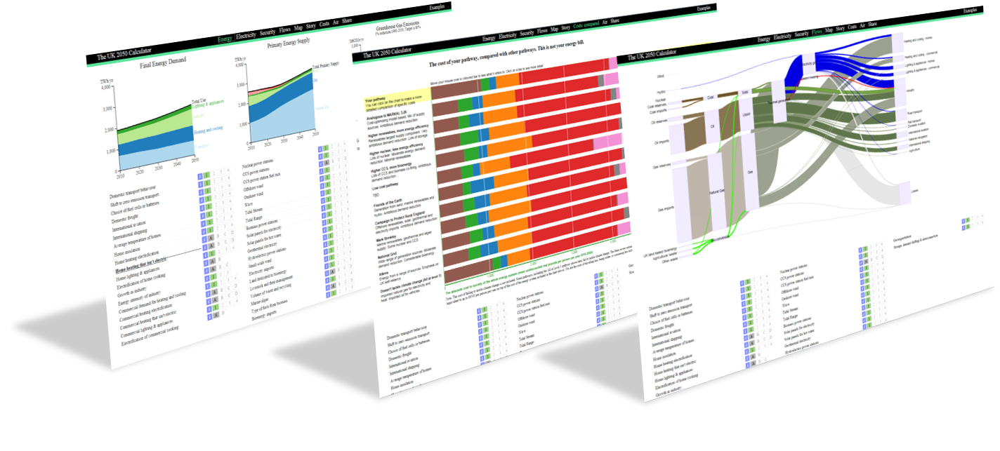

# How the webtool works
## Overview
The ‘Webtool’ is a browser-based version of Excel model that can be accessed by the public over the internet: http://2050-calculator-tool.decc.gov.uk.  It performs the same functions as the Excel model and produces identical results.
	 
The webtool was developed to provide improved experience for users of the Calculator.  It has several advantages over the Excel version:
	 
Simpler: a pathway can be constructed simply by clicking a few buttons.  There is no need to be a confident Excel user (or even have a copy of Excel).
	 
All on one page: the controls and results can be seen simultaneously on one page (unlike the Excel version which requires a lot of scrolling around)
Faster: the model recalculates in microseconds, giving the user instant feedback on their pathway choices

The webtool is based on a C version of the Excel model, which is translated automaticaly using some custom software, which is open source and available from DECC's GitHub page.

## Getting set up
The webtool is based on a translated version of the Excel model, so this must be finished (or very close to) before the webtool can be put together.  As well as providing the calculation engine for the model, many other aspects of the webtool also pass directly from the Excel version.  This includes all the labels for the levers, the level descriptions and the example pathways.
There are a couple of pitfalls to avoid with the Excel file, which can cause issues with the webtool creation process.  Most notably, the Excel file should contain no VBA macros, and no links to external Excel files, either within formulae or named cells/ranges.  A macro that lists any remaining external links is available here: http://2050-calculator-tool-wiki.decc.gov.uk/pages/217 (Links to external named cells must be identified manually using the 'name manager', which is accessed via the formulas toolbar.)
All of the development of the webtool was done on the unix platform, i.e. a Macintosh or linux (we recommend Ubuntu 12.04, 64 bit).  To avoid compatibility issues, it is highly recommended that further development for other country webtools should continue on this platform.  No successful attempts have been made to use this system on Windows (although a Windows computer running an Ubuntu virtual machine would be an option).

Some previous experience of programming is beneficial, as although much of the process is automated, some editing of the underlying code will probably be required.  The backend of the model is written predominantly in the ruby programming language, while the front end is largely JavaScript based.  Familiarity with these two languages would be particularly beneficial.  The extent to which the Ruby code needs to be adapted depends on how far the new Excel model deviates in structure from the UK model.  Similarly, more adaptation of the JavaScript is required if it is intended to diverge from the UK webtool front end.

The webtool source code freely available on GitHub (a web-based hosting service for software development projects that uses the Git revision control system), at the following address: https://github.com/decc/twenty-fifty.  Some knowledge of this platform would be useful, particularly the unix terminal commands that can used to interact with it.  Before making any edit to adapt the UK code, it is necessary to set up a GitHub account and make a 'fork' of the UK twenty-fifty code repository, by clicking the 'fork' button in the top right hand corner of the UK twenty-fifty page.  This will create a copy of the UK code within your user area of the GitHub site, that will act as the starting point for your version of the webtool.

The fastest way to get started with the webtool process when using Ubuntu is to run a pre-prepared set-up script that automatically performs a number of initial steps.  This script is available on the webtool GitHub repository, within the ‘util’ folder: https://github.com/decc/twenty-fifty/blob/master/util/setup-2050-server-script.sh
When run, the script performs the following actions:

* downloads and installs all required dependencies

* downloads and installs ruby (version 2.1)

* downloads all the source code from GitHub (You will be prompted to enter the address of the repository to clone.  Use the address created when you 'forked' the twenty-fifty repository.  This is labelled 'HTTPS clone URL' on the front page of your repository.)

* compiles the c version of the UK model

* downloads and installs the required webserver software

* installs the interface between ruby and the server

If run successfully, the script should create a working local server version of the webtool.  To start the server, navigate to the twenty-fifty folder created by script and enter the terminal command ‘rackup’.  The terminal will then return the port number (e.g. 9292) required to interact with the server in a browser.  The port number should be appended to the IP address of your local machine, which should be 0.0.0.0, to form a URL as follows: 0.0.0.0:9292.  When entered into your browser, this URL should open a functioning version of the UK Calculator running locally on your computer (as opposed to the UK Calculator remote webserver).  If this opens and runs successfully all of the required components are in place and ready to be adapted for a new version for the county in question.

Separate instructions for getting set-up on OS X are available here: https://github.com/decc/twenty-fifty/blob/master/README.md

## Contents of each of the folders

When the twenty-fifty GitHub repository is cloned (as occurs when the above script is run), a number of directories and folders will be downloaded to your computer.  These are listed below

In the top level of the twenty-fifty directory, there are a number of files and folders - the contents of which are as follows

**Files:**

* config.ru - sets up the server and loads the default view
* CREDITS - a list of people who helped build the Calculator
* Gemfile - a list of Ruby Gem dependencies required for the webtool (installed when bundle is run)
* HACKING.md - instructions for adapting the webtool
* README.md - an explanation of the webtool
* Dockerfile - a quick way of getting a server running with this code
* Gemfile.lock - shows successfully installed Gems once Bundle had been run
* LICENCE - details of the webtool's copyright

**Directories:**

* model
    + compile_c_version_if_needed.rb - compiles the translated C code if needed
    + model.o - an intermediate of the C version of the model
    + test_model.rb - makes comparrison of new version vs. the previous version for change confirmation
    + compile_c_version_of_excel.rb - compiles the C translated from the Excel model
    + model.rb - an interface between the C model and the Javascript front end
    + tests - output from the tests
    + data_from_model.rb - specify data inputs and outputs from the C model 
    + model_version.rb - shows the version number from the Excel model
    + translate_excel_into_c.rb - translates the Excel model into C code
    + libmodel.so - an intermediate of the C version of the model
    + model.xlsx - the Excel version of the model
    + model.c - the C code translated from the Excel model
    + README.markdown - an explanation of how to update the webool
* src
    + compile_template.rb
    + index.html.erb
    + javascripts
        - application.js - all JavaScript is assembled into this file
        - controller.js - JavaScript for the lever/level cotrols and ensures the right view is displayed
        - util - some shared methods used by the charts
        - views - the JavaScript files for the views (one file for each view)
    + server.rb - deals with different browsers and old URLs
    + stylesheets - the style sheets for the views
* util
    + setup-ubuntu-12.04.sh - a script for setting up a local version of the UK webtool
    + generate_fractions.rb - handles appearance of the level buttons when a decimal is selected (e.g. level 2.7)
    + generate_hatches.rb - generates striped hatches for use in the charts
* public
    + assets - directory containing one pagers, pictures and assembled application JavaScript and CSS files
* contrib - directory containing 3rd party JavaScript libraries used by the webtool

## Turning the Excel spreadsheet into code

The Excel model (from version 3.5.2) uses a series of named ranges to identify the data inputs and outputs that interface with the webtool.  The ranges are named to reflect their purpose, with the input tables being named, for example 'input.choices' (which contains the users level 1-4 choices for all of the levers), and the ouput tables being named, for example, 'output.finalenergydemand' (which contains a time series from 2010 to 2050 of final energy demand split by the broad categories that appear in the webtool headline results charts).

All of these tables are in a 'dense' format, meaning that they contain no superflous blank rows or columns.

A list of all the relevant named ranges in the Excel file is given below:

inputs named ranges      Outputs named ranges
--------------------     -----------------------------------
input.choices            output.airquality
input.descriptions       output.areas
input.example.pathways   output.capacity.automaticallybuilt
input.long_descriptions  output.costpercapita.detail
input.names              output.diversity
input.onepagenotes       output.finalenergyde
input.types              output.finalenergydemand
                         output.flows
                         output.heating.mix
                         output.imports.proportion
                         output.imports.quantity
                         output.primaryenergysupply
                         output.shannonweinerindex
                         output.version

Table: Input and Output named ranges that recieve / pass data to from / to the webtool front end

Within the ‘twenty-fifty’ directory, created by the set-up script above, there is a sub-directory called ‘model’, and within this there is an Excel file: ‘model.xlsx’.  This is the Excel file on which the webtool is based, which is picked up from this locatin when the translation in run.  This Excel file should be replaced with the new version of the Excel Calculator for which the webtool is being converted.  The new Excel file should also be named ‘model.xlsx’.  Once in place this file is ready to be translated to the C version of the model - but before doing so, a couple of configuration files need to be edited to reflect any changes to the structure of the Excel model compared to the current UK version.  There is a single configuration file which contains the bulk of the edits required for the back-end of the model: ‘data_from_model.rb’.  This file creates the interface that enables the JavaScript used for the front end to communicate with the C model running on the webserver.
NB The translation can actually be run before editing the configuration files to check that the translation actually runs.  It is a good idea to try this at an early stage to allow time to fix any issues with the spreadsheet that upset the translation process (like the macros and external references mentioned above).

## Getting from the model to json
The interface between the webtool front end and the back end model is set up in a single Ruby file, data_from_model.rb.  Within this a class called DataFromModel connects to model.rb, which connects to model.c (which is a translation of the Excel model).

The results of the model are read from references that effecetively refer to the output named ranges (e.g. output.finalenergydemand, as described above).  data_from_model.rb creates a data structure in the JSON data-interchange format, which comprises of a number of labelled arrays which hold the data contained within the input/output Excel named ranges.  This JSON file can be viewed by appending 'data' to the end of the webtool URL, e.g: http://2050-calculator-tool.decc.gov.uk/pathways/11111111111111111111111111111111111111111111111111111/data

## Getting from json to a chart on screen
This explanation continues to use the final energy demand data as an example, but applies generally to all charted data.  Within data_from_model.rg, an array (nested within the larger array) called 'final_energy_demand' is created and set equal to the contents of the output.finalenergydemand named range in the Excel file.  This is done with the following line of code:

    'final_energy_demand' => excel.output_finalenergydemand

The next stage of the process occurs in the relevant javascript file where the chart is to be created.  For example, final energy demand is charted in the primary_energy.js JavaScript file.

At the top of this file (primary_energy.js) a setup function creates three empty charts (for energy demand, primay supply and emissions), making use of the D3 JavaScript library, which allows the control of visual objects using data.

The final energy demand data is converted into a 'hash' called 'demand' which is required before it can be charted.  (NB a hash is an array where each element has an associated key or index.)  This is done using the following line of code, which makes use of convert_table_to_hash function, which is defined within the file

    demand = convert_table_to_hash(pathway.final_energy_demand);

The chart drawing function is then called, specifying that the 'demand'  hash be used to provide the data.  When a user changes their pathway the hash is updated from the new results and the chart is redrawn with the new data.

The primary_energy.js file also contains a 'Teardown' function which is called when the user selects a new view (e.g. costs in context).  This function stops the chart drawing fuctions and tidies up ready for the new view to be loaded.

## Getting from the user's clicking to a new pathway
The users seclected pathway is encoded into the webtools URL (NB: this isn't visible when using Internet Explorer).  For example, the 'all level 1s' pathway looks like this:
    http://2050-calculator-tool.decc.gov.uk/pathways/11111111111111111111111111111111111111111111111111111/primary_energy_chart

Each of the 1s indicate that level 1 is selected for a particular lever.  If the user selects, for example, level 2 for one of the levers the URL will update, and the corresponding 1 will change to a 2.  For example, if the nuclear lever, which corresponds to the first of the 1s is changed to level 2, the URL becomes:

http://2050-calculator-tool.decc.gov.uk/pathways/**2**1111111111111111111111111111111111111111111111111111/primary_energy_chart

When a user chooses a non-integer level (by repeatedly clicking on the level buttons to increment the level by 0.1) this is encoded as a letter within the URL, e.g. 1.1 is encoded as 'b'.  This process is contained within the twenty-fifty/src/javascripts/controller.js JavaScript file, the excerpt from which below, shows the full decimal to letter mapping:

 float_to_letter_map = {
    "": "0",
    1.0: "1",
    1.1: "b",
    1.2: "c",
    1.3: "d",
    1.4: "e",
    1.5: "f",
    1.6: "g",
    1.7: "h",
    1.8: "i",
    1.9: "j",
    2.0: "2",
    2.1: "l",
    2.2: "m",
    2.3: "n",
    2.4: "o",
    2.5: "p",
    2.6: "q",
    2.7: "r",
    2.8: "s",
    2.9: "t",
    3.0: "3",
    3.1: "v",
    3.2: "w",
    3.3: "x",
    3.4: "y",
    3.5: "z",
    3.6: "A",
    3.7: "B",
    3.8: "C",
    3.9: "D",
    0.0: "0",
    4.0: "4"
  };

The string of characters within the URL that represents the selected pathway is stored in an array called 'code'.  This array is then picked up in the data_from_model.rb Ruby file, where it is converted back into a series of numbers in an array named 'choices', to match the format in which the level selections appear in the Excel model:

    choices = convert_letters_to_float(code.split(''))

The named range within the Excel model, input.choices (or the C translation equivalent) is then set equal to the new pathway as contained in the 'choices' array:

    excel.input_choices = choices

With the new pathway selection in place the model is recalculated and the new results are ready to be picked up.

##Updating the webtool for your country's model
1. Finalise you Excel model
2. Read all of this appendix
3. Set up a laptop with a local version of the UK webtool (e.g. using the script mentined above)
4. Make sure all required model inputs and outputs implemented in the Excel file (see detail above)
5. Edit data_from_model.rb with details of changes to the named ranges in the previous step
6. Run translate_excel_into_c.rb to translate the Excel model into C

    PORTEGE-Z830:~/twenty-fifty/model$ ruby translate_excel_into_c.rb

7. Run compile_c_version_of_excel.rb

    PORTEGE-Z830:~/twenty-fifty/model$ ruby compile_c_version_of_excel.rb

8. Edit the JavaSript views to reflect any desired presentational changes
8. Run 'rackup' command from the top of the twenty-fifty directory

    PORTEGE-Z830:~/twenty-fifty$ rackup

9. Navigate to http://0.0.0.0:9292 in your browser (or http://localhost:9292/)

# Modifying the webtool

Below are some tips on how to modify the web tool to suit different needs. They are not fully worked out instructions, you will need to get to know the code and figure things out for yourself.

## Adjusting the scales on the charts

For instance, the UK energy supply and energy demand charts are labeled as being in TWh/yr and go up to 4000. You might want them to be in PJ and go up to 10000. To make the change, open the javascript file for the particular view, in this case `src/javascripts/views/primary_energy.js`, look inside the `setup()` function, find the lines that define the `timeSeriesStackedAreaChart()` and change the text inside the `unit()` to, for instance, `unit("PJ")` and the number inside the `max_value()` to, say `max_value(10000)`.

## Removing the 'shadows' on the electricity charts

In the UK calculator, there are `shadows` on the electricity charts that allow you to visually compare the electricity demand and and supply with the total energy demand and supply. That might not be appropriate for other calculators. You can change it in `src/javascripts/views/electricity.js` by removing all the lines that call the `context()` function, for instance `this.demand_chart.context(total_final_energy)`.

## The energy security table total line is not at the bottom

In some situations the energy security table total line as not always at the bottom of the table. This has been fixed in the new version of the javascript:

https://github.com/decc/twenty-fifty/blob/master/src/javascripts/views/energy_security.js#L148-L154

## Getting the map view to work

The first task in getting the map view to work is to find a map that is the right size. The UK one was 492 pixels by 725 pixels. The new map doesn't have to have an identical size, but shouldn't be too different. This needs to be put in the `/assets/images/` folder.

The settings in `src/javascripts/views/map.js` then need to be changed to make the scales work:

1. The `mapimage_url` needs to be given the name of your new map image.
2. The `map_width` and the `map_height` need to be set to the size of your map image in pixels
3. The `map_offset_x` and `map_offset_y` can be adjusted so the map is in the right sort of location on screen.
4. VERY IMPORTANT: the `km` variable needs to be changed to the number of pixels per km on the map. This can be worked out fairly laboriously by counting the number of pixels on the map that a feature that you know the size of covers.
5. If you have different codes for elements of the maps (e.g., you have a `IV.c` for concentrated solar power) then you need to give the new label a colour and a label in the `colours` and `labels` hashes respectively.
6. The `pointSizes` hash specifies the size in pixels of the items that are drawn as circles rather than areas. You may want these to give a sense of the relative size of, say, a nuclear plant compared with a geothermal plant.

Next, the items have to be placed on the map. That is done by changing the codes in the `land_box_names`, `sea_box_names`, `overseasiand_box_names` and `point_cluster_names`.

These stacks of boxes may not end up in the right place on your map. These will require adjusting of the x and y values in the `updateResults` section. Getting it right is usually a matter of trial and error.

## Adding a completely new set of charts

For instance, you would like to add a new view containing detailed charts on energy security, or a new view containing per capita information. 

In outline, you need to:

1. Get all the calculations working in Excel
2. Produce the charts you would like to see in Excel, linked to those calculations
3. Arrange the data in the Excel into a neat table, and create a named reference to point to it (copy what has been done for one of the existing outputs).
4. We reccomend that the named reference should start with the word `output.`, like `output.percapitaemissions`. If you have used a different sort of name, you will need to modify `model\translate_excel_into_c.rb` to add the name to `named_references_to_keep`.
5. Run the translate_excel_into_c.rb code as you have done before, to get the change into the C version.
Modify `model\data_from_model.rb` to change the `calculate_pathway()` function to include the new data. For example, to insert `'percapitaemissions' => excel.output_percapitaemissions`.
6. Duplicate whatever existing view is closest to what you are looking for. e.g., copy `src/javascripts/views/primary_energy.js` and call it `src/javascripts/views/per_capita_energy.js`.
7. Add a reference to the new file in `src/javascripts/application.js`, e.g., `//= require views/per_capita_energy`.
8. Edit `src/index.html.erb` to include the new view in the drop down menu by adding a line to `
`, e.g., `<a class='view' data-view='per_capita_energy' href='#'>Per Capita Energy & Emissions</a>`
9. Edit your new view javascript (e.g.,  `src/javascripts/views/per_capita_energy.js`) to use the new data. For example, in the `updateResults()` function you might change the reference to `pathway.final_energy_demand` to `pathway.percapitaemissions`. You would probably change the chart's `title`, `unit`, `min_value` and `max_value` in the `setup()` function higher in that file.

