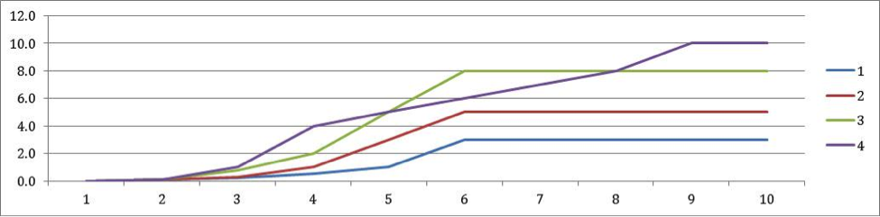

# Common Excel errors and how to avoid them

We have seen from our own experience with the UK 2050 Calculator that it’s too easy for small errors to cause big problems in results. In the calculators launched so far, we have also found a range of issues which can occur in the Excel file. These include problems such as: 

* Simple typing mistakes
* Missing units when entering data
* Labelling which still talks about UK version
* Documentation that isn’t complete or easy to understand
* Formula errors, which are often subtle to spot

However most of these problems are preventable. We’ve put a lot of work
into helping teams to avoid making those errors, and creating systems to
pick up issues when they do occur.

This section (and the accompanying slide-pack available on request from
the 2050 team) give a quick overview of the three main types of common
issues we’ve seen, and some checklists of actions that you could take to
avoid them.

* Errors in the excel formulae (e.g., use of units)
* Errors in the excel layout, documentation, labelling, supporting documents (e.g. referencing sources; labels that relate to the UK version but not the local version)
* Errors in the assumptions (e.g., the different levels for nuclear build)

## Errors in the excel formulae

Errors here mean that the answer will be wrong.

The first type of problem is when data is entered incorrectly into the
model. This is most likely to happen in the Trajectory assumptions or
Fixed assumptions parts of the spreadsheet.

In other models we have seen errors such as the following:

+--------------------------------------+--------------------------------------+
| **Issue**                            | **How does this cause problems**     |
+--------------------------------------+--------------------------------------+
| Numbers entered without multiplying  | As an example, you cannot just enter |
| by the relevant units                | the number 0.6 into a cell, as this  |
|                                      | will cause problems in future        |
|                                      | calculation (especially if you ever  |
|                                      | change the preferred unit).          |
|                                      |                                      |
|                                      | Best practice is that you must       |
|                                      | always multiply an input value by a  |
|                                      | unit:                                |
|                                      |                                      |
|                                      | See 4 (Units) for guidance about how |
|                                      | this should be done                  |
+--------------------------------------+--------------------------------------+
| Missing data in certain years        | Having blank cells rather than       |
|                                      | numbers in a baseline year or the    |
|                                      | final year could make a big          |
|                                      | difference in the charts,            |
|                                      |                                      |
|                                      | E.g. when you’re using 2010 and 2050 |
|                                      | values to estimate values in earlier |
|                                      | years, a missing number in each cell |
|                                      | could cause errors                   |
+--------------------------------------+--------------------------------------+

The next type of issue is when formulae refer to the wrong input value,
giving an incorrect calculation and results.

+--------------------------------------+--------------------------------------+
| **Issue**                            | **How does this cause problems**     |
+--------------------------------------+--------------------------------------+
| Numbers entered without multiplying  | Inconsistencies:                     |
| by the relevant units                |                                      |
|                                      | E.g. a formula which referred to     |
|                                      | cement, but it gathered the data for |
|                                      | 'Chemicals & petrochemicals'         |
|                                      |                                      |
|                                      | E.g., one model was referring to new |
|                                      | capacity where it should be          |
|                                      | cumulative (or vice versa)           |
+--------------------------------------+--------------------------------------+
| Linking up levers to the wrong user  | For example, in one model, the       |
| input setting                        | sub-lever for carbon capture and     |
|                                      | storage efficiency was incorrectly   |
|                                      | linked to fossil fuel efficiency,    |
|                                      | rather than 'carbon capture and      |
|                                      | storage'                             |
+--------------------------------------+--------------------------------------+
| Links to named ranges that no longer | References to deleted cells – these  |
| exist                                | will cause \#REF errors)             |
|                                      |                                      |
|                                      | e.g. Global hot water and Global     |
|                                      | cooking calculations gave \#REF      |
|                                      | errors, as they refer to now         |
|                                      | nonexistent non-residential cells    |
+--------------------------------------+--------------------------------------+
| Errors with sums that refer to       | When copying a formula down, it’s    |
| incorrect rows or miss out a row)    | easy to accidentally cause errors:   |
|                                      |                                      |
|                                      | e.g. In one model, a row was         |
|                                      | supposed to sum all rural            |
|                                      | passengers, but excluded the last    |
|                                      | two types of transport (global rural |
|                                      | trains)                              |
|                                      |                                      |
|                                      | e.g. A household total               |
|                                      | double-counted the rural households  |
|                                      | by including the rural subtotal in   |
|                                      | the sum.                             |
+--------------------------------------+--------------------------------------+
| Looking up values incorrectly        | Looking up a value by only one       |
|                                      | variable, when it needs to match     |
|                                      | against another variable too         |
|                                      |                                      |
|                                      | e.g. The costs are looked up by fuel |
|                                      | type, but not the selected cost      |
|                                      | estimate (point/high/low)            |
+--------------------------------------+--------------------------------------+
| External link errors                 | Sometimes formulae showing as \#REF  |
|                                      | or with outdated numbers because     |
|                                      | they link to a separate workbook)    |
|                                      |                                      |
|                                      | Appendix xxx gives guidance on this  |
+--------------------------------------+--------------------------------------+
| Incorrect totalling                  | e.g. Numbers should add to 100% for  |
|                                      | different types of transport. If     |
|                                      | they don’t, subtle problems will     |
|                                      | appear later                         |
|                                      |                                      |
|                                      | To solve this, we advise setting up  |
|                                      | a formula so that one of your values |
|                                      | is set to be 100% - the sum of the   |
|                                      | others                               |
|                                      |                                      |
|                                      | Alternatively you could add          |
|                                      | checksums below each table, to show  |
|                                      | the sum of all values, and display   |
|                                      | an error message if the total isn’t  |
|                                      | 100%                                 |
+--------------------------------------+--------------------------------------+

The third type of formula errors are calculations that are incorrect.
These are logical errors in the steps of a calculation, and are often
subtle to spot. For this reason, it’s good to get other people to look
at your work, and look for errors such as these below:

+--------------------------------------+--------------------------------------+
| **Issue**                            | **How does this cause problems**     |
+--------------------------------------+--------------------------------------+
| Formulae with hardcoded numbers      | When formulae use hardcoded numbers, |
|                                      | small changes can overwrite them     |
|                                      |                                      |
|                                      | e.g. A formula that hardcoded growth |
|                                      | rates which varied over the time     |
|                                      | period. This became wrong when       |
|                                      | copied to the right, as the          |
|                                      | hardcoded value for later years was  |
|                                      | overwritten by earlier years of data |
+--------------------------------------+--------------------------------------+
| Duplicate and inconsistent data      | For example, population figures used |
|                                      | frequently should be looked up from  |
|                                      | global assumptions. Then changes     |
|                                      | only need to be made in one place    |
+--------------------------------------+--------------------------------------+
| Using figures as if they are a       | It is important to double-check that |
| different unit                       | you know the units of all input      |
|                                      | data:                                |
|                                      |                                      |
|                                      | e.g. In one model, a calculation     |
|                                      | tried to use cost data related to    |
|                                      | manufacturing, but this was actually |
|                                      | still in units of energy.            |
|                                      |                                      |
|                                      | e.g. A cell accidentally used        |
|                                      | unit.minute, instead of unit.m       |
|                                      |                                      |
|                                      | e.g. One model calculated area by    |
|                                      | multiplying by a ‘per GW’ figure.    |
|                                      | However because this calculation was |
|                                      | for just one plant (which could be   |
|                                      | 1/1,000 GW) the order of magnitude   |
|                                      | was very wrong                       |
+--------------------------------------+--------------------------------------+
| Using the MATCH function with only 2 | The MATCH function behaves strangely |
| arguments, rather than the 3 needed  | when the third (optional) argument   |
|                                      | is missing: 'match type‘: MATCH      |
|                                      | (*lookup value, lookup array*,       |
|                                      | ***match type***)                    |
|                                      |                                      |
|                                      | If the third argument is missing, it |
|                                      | defaults to 1, finding only ‘the     |
|                                      | largest value that is less than or   |
|                                      | equal to the lookup value’           |
|                                      |                                      |
|                                      | Best practice is:                    |
|                                      |                                      |
|                                      | Never leave a MATCH formula with     |
|                                      | only 2 arguments                     |
|                                      |                                      |
|                                      | Always use 0 as the last argument,   |
|                                      | so your formulae should look like    |
|                                      | this: MATCH (*lookup value, lookup   |
|                                      | array,* **0**)                       |
|                                      |                                      |
|                                      | This means finding “the exact match  |
|                                      | of the lookup value, and in this     |
|                                      | case the values in the lookup array  |
|                                      | can be in any order”                 |
+--------------------------------------+--------------------------------------+
| Extrapolating incorrectly            | Many formulae in the calculator use  |
|                                      | interpolation: this means using the  |
|                                      | values of two years (e.g. 2010 and   |
|                                      | 2050) and calculating other figures  |
|                                      | based on a straight line increase    |
|                                      | between these numbers.               |
|                                      |                                      |
|                                      | One problem is that numbers that can |
|                                      | become negative when they shouldn’t  |
|                                      | be able to. For example, production  |
|                                      | numbers which are decreasing, and    |
|                                      | went below zero when extrapolated    |
|                                      | into the future                      |
|                                      |                                      |
|                                      | e.g. for calculations which multiply |
|                                      | the average yearly use by the number |
|                                      | of years, make sure that they adjust |
|                                      | to intervals less than 5 years (e.g. |
|                                      | 2011 to 2015 should use 4 years)     |
+--------------------------------------+--------------------------------------+
| Formulae copied to another place     | When copying a formula to be used in |
| without crucial changes              | a slightly different way, make sure  |
|                                      | that any necessary changes are made: |
|                                      |                                      |
|                                      | E.g. In a calculation where number   |
|                                      | of households is always urban- the   |
|                                      | reference didn’t change for the      |
|                                      | urban calculation                    |
+--------------------------------------+--------------------------------------+
| INDEX/MATCH formula refers to        | E.g. a formula which uses the        |
| different tables                     | 'index' function, but matches        |
|                                      | against a different table to where   |
|                                      | the data is coming from              |
+--------------------------------------+--------------------------------------+
| Forgetting to use weighted averages  | Forgetting to use weighted average   |
|                                      | (or weighting by the wrong variable) |
|                                      |                                      |
|                                      | e.g. when taking an average of 3     |
|                                      | technology costs, you will probably  |
|                                      | want to weight them by energy use or |
|                                      | capacity, rather than a straight     |
|                                      | average.                             |
+--------------------------------------+--------------------------------------+
| Unclear Changes in formulae          | Ideally avoid formulae that change   |
|                                      | midway through an array, row or      |
|                                      | column. But if critical, use         |
|                                      | comments to state this has happened  |
|                                      | and why                              |
+--------------------------------------+--------------------------------------+

There are also issues with vectors that are well worth checking (see
Appendix 3 - Vectors for details of how vectors work within the model).

+--------------------------------------+--------------------------------------+
| **Issue**                            | **How does this cause problems**     |
+--------------------------------------+--------------------------------------+
| Vectors that don’t balance           | You can check this by looking at the |
|                                      | row that should be zero in           |
|                                      | intermediate output sheet            |
+--------------------------------------+--------------------------------------+
| Invalid conversions                  | Conversions between vectors (e.g.    |
|                                      | solid-liquid biocarbons) without the |
|                                      | corresponding calculation of energy  |
|                                      | loss                                 |
+--------------------------------------+--------------------------------------+
| Vectors not Exhaustive/              | Good practice is that vectors are    |
| mutually-exclusive                   | distinct, and any type of energy is  |
|                                      | clearly allocated to one vector      |
|                                      | (unless it’s deliberately converted  |
|                                      | to another type)                     |
+--------------------------------------+--------------------------------------+

## Errors in the excel layout, documentation, labelling, supporting documents 

Errors here mean that others won’t be able to follow the work, and
will have lower confidence in the answers

The types of error that we have seen in documentation are the following:

+--------------------------------------+--------------------------------------+
| **Issue**                            | **How does this cause problems**     |
+--------------------------------------+--------------------------------------+
| References left from the UK version  | It can get confusing when references |
|                                      | are left from the UK version,        |
|                                      | especially if it’s not clear whether |
|                                      | the numbers have changed:            |
|                                      |                                      |
|                                      | e.g. Mentions of oil/coal in a sheet |
|                                      | which now only includes calculations |
|                                      | for gas                              |
+--------------------------------------+--------------------------------------+
| Leaving calculations blank           | Good practice would be to either:    |
|                                      |                                      |
|                                      | delete calculations if they will     |
|                                      | never be used                        |
|                                      |                                      |
|                                      | leave the calculations in the file,  |
|                                      | but clearly label that they are out  |
|                                      | of scope for the first phase of the  |
|                                      | calculator launch                    |
+--------------------------------------+--------------------------------------+
| Incorrect table titles               | e.g. Table title is "per year", but  |
|                                      | the descriptions are "per day" and   |
|                                      | the equations calculate figures per  |
|                                      | day                                  |
+--------------------------------------+--------------------------------------+
| Incorrect documentation              | Unclear or ambiguous documentation   |
|                                      | about assumptions                    |
|                                      |                                      |
|                                      | e.g. what counts as import vs.       |
|                                      | domestic                             |
+--------------------------------------+--------------------------------------+
| Incorrect units                      | Incorrect units (e.g. figures which  |
|                                      | are expressed as % but the unit of   |
|                                      | the table is listed as households)   |
|                                      |                                      |
|                                      | Descriptions e.g. 1 years, when it’s |
|                                      | 5-year incremental capacity          |
+--------------------------------------+--------------------------------------+
| Incorrect rounding                   | Is rounding performed in a correct   |
|                                      | way? Are rounded numbers and         |
|                                      | original numbers used in the correct |
|                                      | places?                              |
+--------------------------------------+--------------------------------------+
| Sector sheet names                   | Sector names can be hard to          |
|                                      | understand,                          |
|                                      |                                      |
|                                      | We have also seen cases where they   |
|                                      | don’t match the names of the levers  |
|                                      |                                      |
|                                      | e.g. the name of the sheet might be  |
|                                      | Iv.a but the label at the top of the |
|                                      | sheet says Iv.b                      |
+--------------------------------------+--------------------------------------+
| Complex and undocumented             | When complex calculations aren’t     |
| calculations                         | described fully in methodology, it   |
|                                      | becomes very difficult for other     |
|                                      | people to understand what has been   |
|                                      | done. It will also make future       |
|                                      | updates by your team much more       |
|                                      | difficult                            |
+--------------------------------------+--------------------------------------+
| Wrong sections of sector sheet       | For example, if numbers are listed   |
|                                      | in fixed assumptions section but     |
|                                      | depend on settings for trajectories, |
|                                      | changes could be made incorrectly    |
+--------------------------------------+--------------------------------------+
| Inconsistent structure between       | It gets difficult to understand      |
| worksheets                           | workbooks if the structure is        |
|                                      | inconsistent across worksheets       |
|                                      |                                      |
|                                      | E.g. do similar worksheets have      |
|                                      | similar structures? Are similar      |
|                                      | tables laid out in similar way?      |
+--------------------------------------+--------------------------------------+

##  Errors in the assumptions

Errors here mean that the answers given by the model won’t reflect the true breadth of opportunity the country face

Issues in the level of ambition of levels 1 and 4 can include:

+--------------------------------------+--------------------------------------+
| **Issue**                            | **How does this cause problems**     |
+--------------------------------------+--------------------------------------+
| Lack of ambition in level 4          | Level 4s which don’t seem as         |
|                                      | ambitious as they could be           |
|                                      |                                      |
|                                      | e.g. some of the transport levers in |
|                                      | the UK model                         |
+--------------------------------------+--------------------------------------+
| Jumps in one or more years           | In general, trajectories seem most   |
|                                      | believable when they increase in a   |
|                                      | straight line, or in a curve.        |
|                                      |                                      |
|                                      | At times, it is understandable that  |
|                                      | some trajectories may increase       |
|                                      | rapidly towards later years, or have |
|                                      | a delay in starting.                 |
|                                      |                                      |
|                                      | However when a particular year is    |
|                                      | unusually high/low, and the years    |
|                                      | immediately before and afterwards    |
|                                      | are inconsistent, it tends to        |
|                                      | indicate an error                    |
+--------------------------------------+--------------------------------------+
| Surprisingly high level 1s           | Level 1 should represent a ‘do       |
|                                      | nothing’ option. For example, this   |
|                                      | may involve closing existing/planned |
|                                      | capacity early.                      |
+--------------------------------------+--------------------------------------+
| Incorrect overlap between levels     | Trajectories where level 3 is        |
|                                      | sometimes more ambitious than 4      |
|                                      | (like the example below)             |
+--------------------------------------+--------------------------------------+
| Missing inter- relationships between | Missing out dependencies between     |
| levers                               | different trends (e.g. if household  |
|                                      | numbers rise, everything depending   |
|                                      | on those should rise)                |
+--------------------------------------+--------------------------------------+
| Putting key figures as fixed         | For example, assuming a certain      |
| assumptions                          | figure (e.g. industry growth) is a   |
|                                      | particular level, without giving the |
|                                      | user a choice in varying this        |
+--------------------------------------+--------------------------------------+
| Assumptions that aren’t documented   | e.g. if biofuels count as zero       |
|                                      | emissions, this must be documented   |
|                                      | and implemented in all relevant      |
|                                      | sheets                               |
+--------------------------------------+--------------------------------------+

